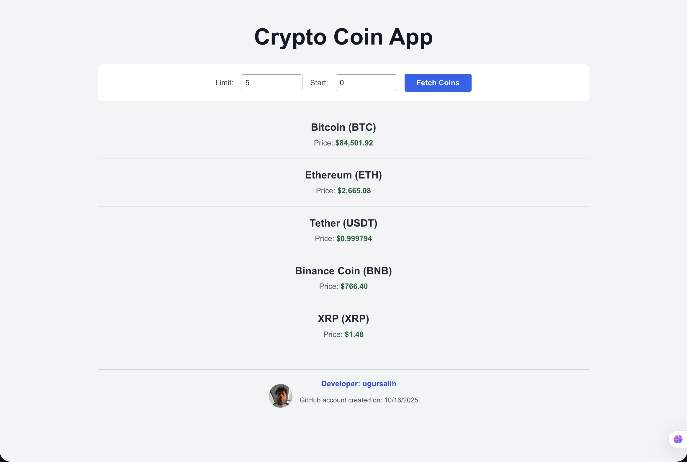

# Crypto Coin App

A React application for browsing cryptocurrency prices through an AWS-hosted API. Built as a front-end portfolio project.

## Screenshot



## Features

- Display cryptocurrency names, symbols, and prices in USD.
- Choose how many coins to load, from 1 to 100.
- Set a starting position to browse different results.
- Validate inputs before sending requests.
- Show loading, empty-result, and error messages.
- Apply a 15-second timeout to API requests.
- Display developer information from the GitHub API.
- Support smaller screens with a flexible layout.

## Technologies

- React
- JavaScript
- Vite
- CSS
- AWS Amplify configuration
- AWS API Gateway endpoint
- GitHub REST API
- ESLint

## Getting Started

Use Node.js 22.13 or newer within the Node.js 22 release line. This project was checked with Node.js 22.23.3.

Clone the repository:

```bash
git clone https://github.com/ugursalih/project3-crypto-app.git
cd project3-crypto-app
```

Install dependencies and start the development server:

```bash
npm ci
npm run dev
```

Open the local URL printed in the terminal.

## Usage

1. Enter a result limit between 1 and 100.
2. Enter a starting position of 0 or greater.
3. Select the load button to request coin data.

Prices depend on the data returned by the external API.

## Checks and Production Build

Run the code checks:

```bash
npm run lint
```

Create a production build:

```bash
npm run build
```

Preview the production build locally:

```bash
npm run preview
```

## API Dependencies

Coin data is requested from an existing AWS API Gateway endpoint. Developer information is requested from GitHub's public API.

An internet connection and available external services are required. The AWS backend implementation is not included in this repository.

## Author

[Ugur Salih](https://github.com/ugursalih)